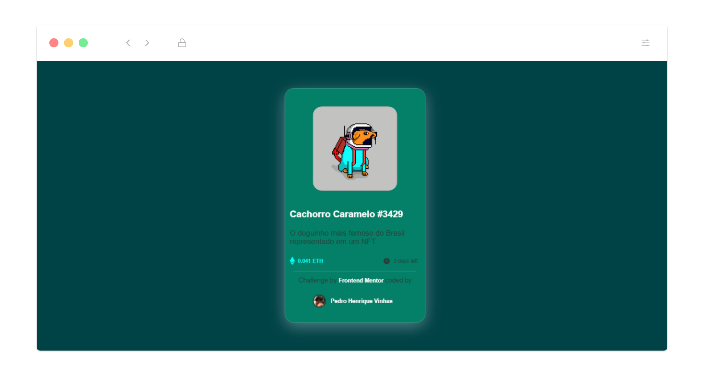
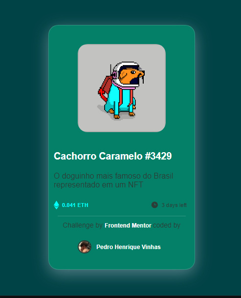

# Frontend Mentor - NFT preview card component

## Table of contents

- [Overview](#overview)
  - [The challenge](#the-challenge)
  - [Screenshot](#screenshot)
  - [Links](#links)
  - [Built with](#built-with)
  - [What I learned](#what-i-learned)
- [Author](#author)

## Welcome! 👋

### The first challenge 

This is a solution to the [NFT preview card component challenge on Frontend Mentor](https://www.frontendmentor.io/challenges/nft-preview-card-component-SbdUL_w0U) with some features and changes that i try to implement in this project. 

You should consult [style-guide-md](https://github.com/Pedrovinhas/front-end-mentor/blob/master/newbie/NFT-Card-Component/style-guide.md) to check all infos about the design before start coding.
## Screenshot
### Mobile

### Links

- Solution URL: [Add solution URL here](https://your-solution-url.com)
- Live Site URL: [Add live site URL here](https://your-live-site-url.com)

### Built with

- [x]  Semantic HTML5 markup
- [x]  CSS custom properties
- [x]  Flexbox
- [x]  SCSS
### What I learned
- Centralize card component
- Architectural Design with SCSS files
- Use correct HTML tags

## Author
---
> Feito por Pedro Henrique Vinhas 🪐

> Frontend Mentor - [@pedrovinhas](https://www.frontendmentor.io/profile/pedrovinhas)

