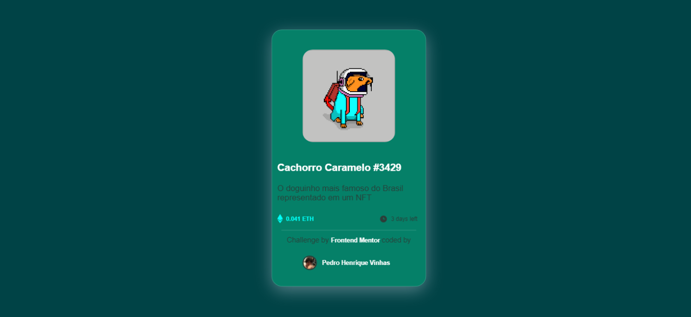
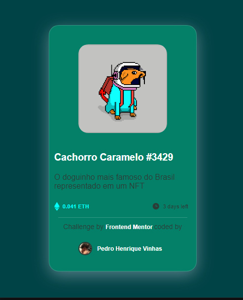

# Frontend Mentor - NFT preview card component

This is a solution to the [NFT preview card component challenge on Frontend Mentor](https://www.frontendmentor.io/challenges/nft-preview-card-component-SbdUL_w0U) with some features and changes that i try to implement in this project.

## Table of contents

- [Overview](#overview)
  - [The challenge](#the-challenge)
  - [Screenshot](#screenshot)
  - [Links](#links)
- [My process](#my-process)
  - [Built with](#built-with)
  - [What I learned](#what-i-learned)
  - [Useful resources](#useful-resources)
- [Author](#author)

## Overview

### The challenge

## Screenshot

### Links

- Solution URL: [Add solution URL here](https://your-solution-url.com)
- Live Site URL: [Add live site URL here](https://your-live-site-url.com)

## Front-end Style Guide

## Layout

The designs were created to the following widths:

- Mobile: 375px
- Desktop: 1440px

## Colors

### Primary

- Soft blue: hsl(215, 51%, 70%)
- Cyan: hsl(178, 100%, 50%)

### Neutral

- Very dark blue (main BG): hsl(217, 54%, 11%)
- Very dark blue (card BG): hsl(216, 50%, 16%)
- Very dark blue (line): hsl(215, 32%, 27%)
- White: hsl(0, 0%, 100%)

## Typography

### Body Copy

- Font size (paragraph): 18px

### Font

- Family: [Outfit](https://fonts.google.com/specimen/Outfit)
- Weights: 300, 400, 600

### Built with

[X] -  Semantic HTML5 markup
[X] - CSS custom properties
[X] - Flexbox
[X] - Mobile-first workflow
[X] - [SCSS](https://reactjs.org/) - CSS Pre-processor

### What I learned

### Useful resources

- [Example resource 1](https://www.example.com) - This helped me for XYZ reason. I really liked this pattern and will use it going forward.
- [Example resource 2](https://www.example.com) - This is an amazing article which helped me finally understand XYZ. I'd recommend it to anyone still learning this concept.

## Author

- Frontend Mentor - [@yourusername](https://www.frontendmentor.io/profile/yourusername)
- Twitter - [@yourusername](https://www.twitter.com/yourusername)

